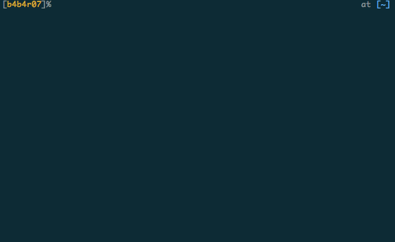

# :dragon: Brionac

A simple alternative means of the Brewfile

## Description

One day, `brew bundle` is deprecated.

> [What? “Warning: brew bundle is unsupported …” #30815](https://github.com/Homebrew/homebrew/issues/30815)

Having said that, we want to manage in the Brewfile. Although there are some alternative means, they are too multi-functional to deal with "formula" installation easily. We just want to simplify the installation using the Brewfile. Then, it is :dragon: *Brionac* !!.

Brionac will only install the formula described in the `formula.yaml`. Strictly speaking, Brionac synchronize formulas to `formula.yaml`. Also, Brionac will uninstall the formula that are installed without being described in `formula.yaml`

***DEMO:***



## Features

- Install the formula described in `formula.yaml`
- Uninstall the formula that are installed without being described in `formula.yaml`

## Requirements

- [Homebrew](https://brew.sh)

## Usage

```bash
$ brionac attack
```

If no arguments are given, Brionac will synchronise based on the `formula.yaml`.

For more information, see `brionac help`

### Example

See sample of `formula.yaml` below.

```yaml
---
tap:
  - b4b4r07/brionac
  - b4b4r07/gomi

brew:
  install:
    - { name: git }
    - { name: gomi }
    - { name: brionac }
    - { name: reattach-to-user-namespace }
    - { name: the_silver_searcher }
    - { name: tig }
    - { name: tmux }
    - { name: vim, args: --with-lua }
    - { name: zsh, args: --disable-etcdir }
    - { name: peco }
```

## Installation

The fact that you are interested in the Brionac shows that you are a homebrew user.

	$ brew tap b4b4r07/brionac
	$ brew install brionac

or go to the [releases page](Link), find the version you want, download the binary file, and put it in your `$PATH`

## Author

[BABAROT](http://tellme.tokyo) a.k.a. b4b4r07

## License

Released under the [MIT](https://raw.githubusercontent.com/b4b4r07/dotfiles/master/doc/LICENSE-MIT.txt) License.
